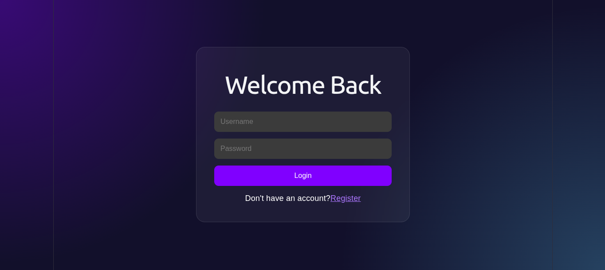
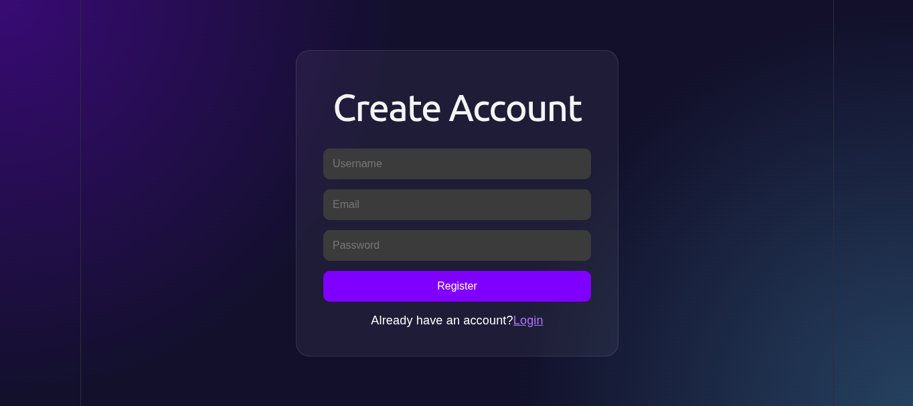
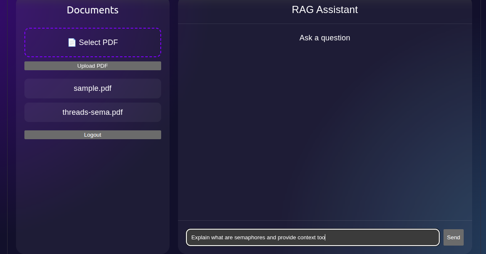
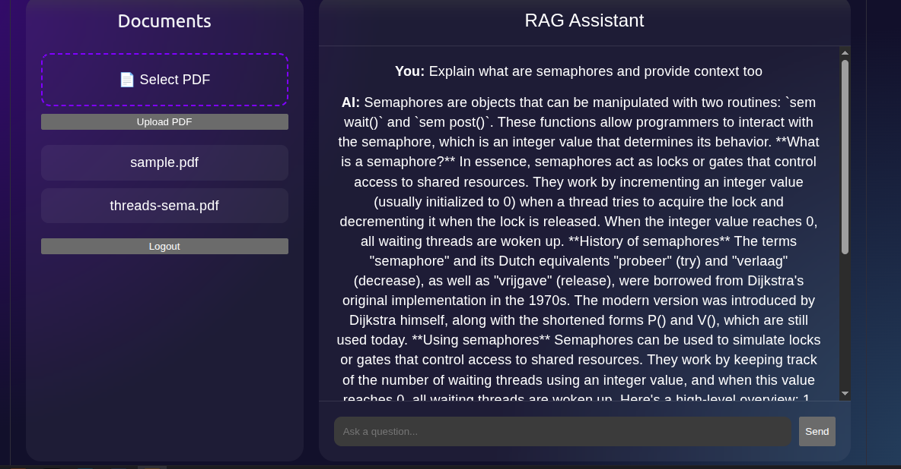
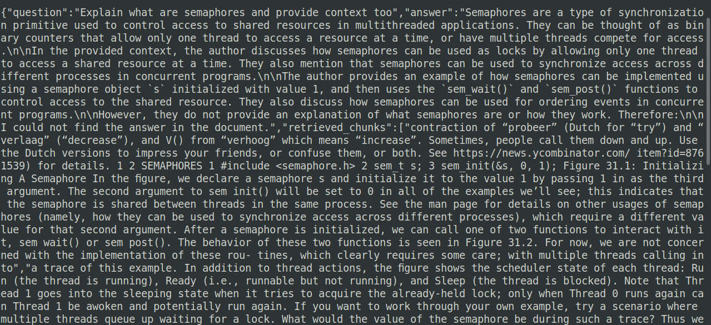

#  RAG Application

> **A Full-Stack Retrieval-Augmented Generation (RAG) Application** built using **React, FastAPI, MySQL, ChromaDB, and Ollama** that allows authenticated users to upload their own documents and ask natural language questions grounded in those documents through semantic search.

---

##  Table of Contents

- [Overview](#-overview)
- [Features](#-features)
- [Architecture](#-architecture)
- [Tech Stack](#-tech-stack)
- [Project Workflow](#-project-workflow)
- [Project Structure](#-project-structure)
- [API Endpoints](#-api-endpoints)
- [Screenshots](#-screenshots)
- [Getting Started](#-getting-started)
- [Future Improvements](#-future-improvements)
- [Key Learnings](#-key-learnings)
- [Why This Project Stands Out](#-why-this-project-stands-out)

---

#  Overview

Large Language Models are excellent at generating responses but cannot answer questions about private documents unless provided with the required context.

This project implements a complete **Retrieval-Augmented Generation (RAG)** pipeline where users can upload documents, have them indexed into a vector database, and ask questions that are answered using only the most relevant retrieved document chunks.

The application also includes secure user authentication, ensuring that each user can only access and query their own uploaded documents.

---

#  Features

##  Authentication
- User Registration
- Secure Login
- JWT Authentication
- Password Hashing
- Protected API Routes

##  Document Management
- Upload documents
- Store metadata in MySQL
- Associate every document with its owner
- Retrieve user-specific documents

##  Retrieval-Augmented Generation
- Automatic text chunking
- Configurable chunk overlap
- Embedding generation
- ChromaDB vector indexing
- Semantic similarity search
- Document-specific querying
- Context-aware prompt augmentation
- Local LLM inference using Ollama

##  Frontend
- Modern React interface
- Login & Registration pages
- Dashboard
- Document Upload
- Document Listing
- AI Chat Interface

##  Backend
- FastAPI REST APIs
- SQLAlchemy ORM
- Modular architecture
- JWT-based authorization
- Exception handling

---

#  Architecture

```text
                  User
                    │
            React Frontend
                    │
          FastAPI Backend
                    │
     ┌──────────────┴──────────────┐
     │                             │
  MySQL Database             Uploaded Document
                                    │
                            Text Extraction
                                    │
                                Chunking
                                    │
                        Embedding Generation
                                    │
                             Chroma Vector DB
                                    │
                           Semantic Retrieval
                                    │
                         Retrieved Context Chunks
                                    │
                      Prompt + Retrieved Context
                                    │
                           Ollama (Local LLM)
                                    │
                             Generated Response
```

---

#  Tech Stack

| Category | Technologies |
|----------|--------------|
| Frontend | React, Axios, CSS |
| Backend | FastAPI, Python |
| Database | MySQL |
| ORM | SQLAlchemy |
| Authentication | JWT, Passlib |
| Vector Database | ChromaDB |
| AI | Ollama, Sentence Transformers |
| API Testing | Swagger UI, Terminal Testing |

---

#  Project Workflow

1. User registers and logs in.
2. JWT token is generated after authentication.
3. User uploads a document.
4. Text is extracted and split into overlapping chunks.
5. Each chunk is converted into embeddings.
6. Embeddings are stored in ChromaDB.
7. User asks a question.
8. The question is embedded.
9. Similar document chunks are retrieved.
10. Retrieved context is combined with the user query.
11. Ollama generates a context-aware response.
12. Response is displayed in the frontend.

---

#  Project Structure

```text
RAG-Application/
│
├── backend/
│   ├── auth/
│   ├── database/
│   ├── models/
│   ├── routes/
│   ├── utils/
│   ├── uploads/
│   ├── chroma_db/
│   └── main.py
│
├── frontend/
│   ├── src/
│   ├── components/
│   ├── pages/
│   └── services/
│
└── README.md
```

---

#  API Endpoints

| Method | Endpoint | Description |
|--------|----------|-------------|
| POST | `/register` | Register user |
| POST | `/login` | Login user |
| POST | `/upload` | Upload document |
| GET | `/documents` | Fetch uploaded documents |
| POST | `/query` | Query uploaded documents |

---

#  Screenshots

## Home Page and Login

> 

---


## Register

> 

---

## Dashboard- Question 

> 

---

## Query Response generation

> 

---

## Retrieved Chunks Proof

> 

---

#  Getting Started

## Clone the Repository

```bash
git clone https://github.com/mihirv23/RAG-Application
```

## Backend

```bash
cd backend
python -m venv venv
source venv/bin/activate

pip install -r requirements.txt

uvicorn main:app --reload
```

## Frontend

```bash
cd frontend
npm install
npm run dev
```

---

#  Future Improvements

- Chat history
- Streaming responses
- Hybrid Search (BM25 + Vector Search)
- PDF page citations
- OCR support
- Docker deployment
- Kubernetes deployment
- Multi-model support
- Role-based access control
- Cloud deployment

---

#  Key Learnings

- Retrieval-Augmented Generation (RAG)
- Semantic Search
- Vector Databases
- Embedding Models
- JWT Authentication
- FastAPI Development
- React Integration
- SQLAlchemy ORM
- Prompt Engineering
- Local LLM Deployment
- Full-Stack AI Development

---

#  Why This Project Stands Out

Unlike basic chatbot applications, this project demonstrates an end-to-end AI system that combines authentication, database design, vector search, semantic retrieval, prompt augmentation, and local LLM inference. It showcases the ability to build production-style AI applications by integrating modern frontend technologies with scalable backend services and AI infrastructure.

---

##  Author

**Mihir Vijay**

If you found this project interesting, consider giving it a ⭐ on GitHub!
